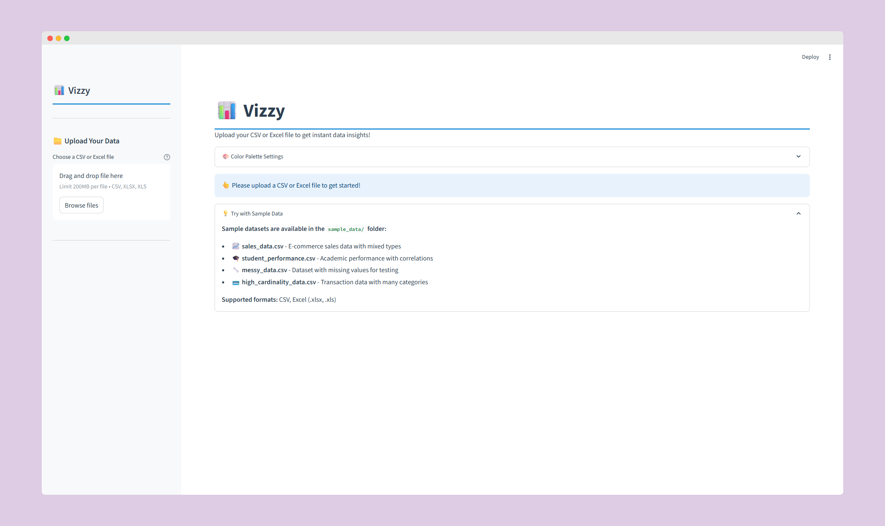
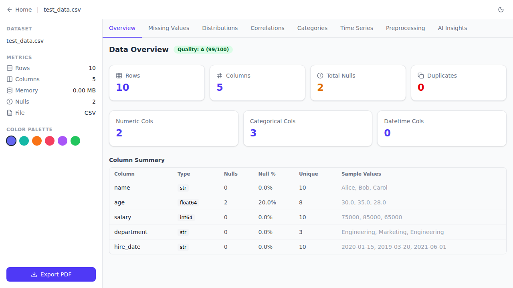
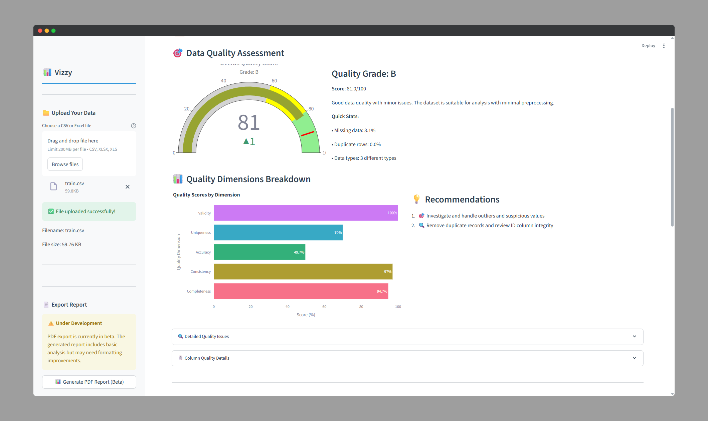
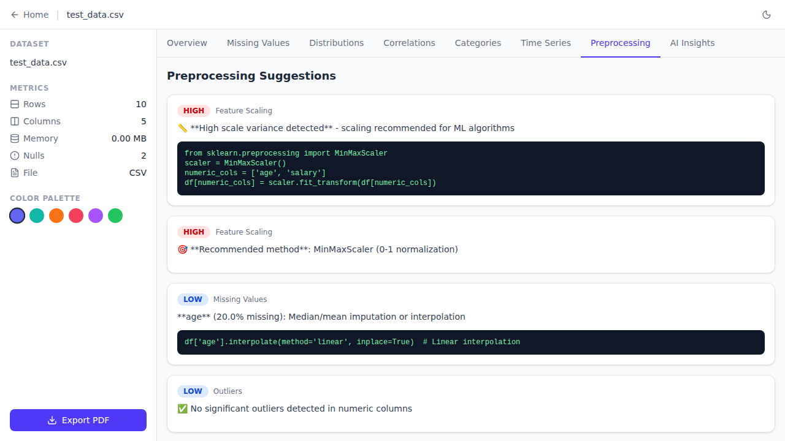
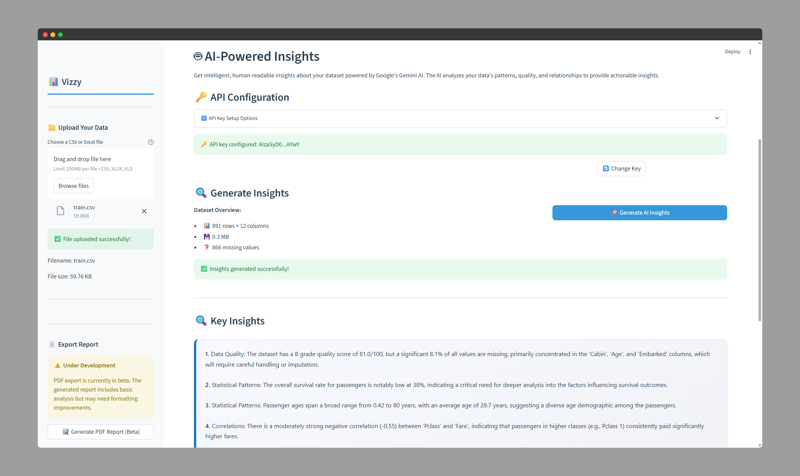

# 📊 Vizzy

A **Streamlit-powered** data visualization tool that provides instant, comprehensive insights from CSV and Excel files with AI-powered analysis.



## ✨ Key Features

- 📁 **Easy File Upload** - CSV and Excel support
- 🎯 **Data Quality Scoring** - Comprehensive health assessment
- 🛠️ **Smart Preprocessing** - AI-powered recommendations with code
- 📊 **Rich Visualizations** - Distributions, correlations, and time series
- 🤖 **AI Insights** - Human-readable analysis via Google Gemini
- 📄 **PDF Reports** - Professional analysis exports
- 🎨 **Custom Themes** - 12+ beautiful color palettes
- 🔄 **Stable Navigation** - No tab switching when interacting with buttons



## 🚀 Quick Start

### Prerequisites

- Python 3.10+
- [Google Gemini API key](https://aistudio.google.com/app/apikey) (free)

### Installation

```bash
git clone <repository-url>
cd "Data Visualizer"
pip install -r requirements.txt
```

### API Key Setup (for AI Insights)

**Option 1: Environment File (Recommended)**

```bash
copy .env.example .env
# Edit .env and add your API key:
# GEMINI_API_KEY=your_actual_api_key_here
```

**Option 2: Manual Entry**

- Enter your API key in the 🤖 AI Insights tab
- Optionally save for future sessions

### Run Application

```bash
python run.py
```

Open your browser at `http://localhost:8501`


## 📖 Usage

1. **Upload Data** - Drag & drop CSV/Excel files
2. **Choose Theme** - Select from 12+ color palettes
3. **Explore Tabs** - Navigate through analysis sections:
   - 📋 **Data Overview** - Preview and basic stats
   - ❓ **Missing Values** - Null pattern analysis
   - 📊 **Distributions** - Histograms and box plots
   - 🔗 **Correlations** - Relationship analysis
   - 📂 **Categories** - Categorical data insights
   - 📈 **Time Series** - Temporal pattern analysis
   - 🛠️ **Preprocessing** - Smart cleaning suggestions
   - 🤖 **AI Insights** - LLM-powered analysis
4. **Export Results** - Download insights and reports


### Supported Formats

- `.csv` (UTF-8, Latin-1)
- `.xlsx/.xls` (Excel files)

## 🏗️ Project Structure

```
vizzy/
├── app.py                    # Main Streamlit application
├── style.py                  # Global themes and styling
├── requirements.txt          # Dependencies
├── utils/                    # Core utilities
│   ├── data_checks.py       # Data quality analysis
│   ├── file_loader.py       # File handling
│   └── insights_generator.py # AI insights
├── visuals/                 # Visualization functions
├── components/              # UI components
└── sample_data/             # Sample datasets
```

## 🎨 Features Overview



### Data Quality Scoring

- **5 Quality Dimensions** - Completeness, consistency, accuracy, uniqueness, validity
- **Letter Grades** - A-F scoring with actionable recommendations
- **Visual Dashboard** - Interactive quality gauge



### Smart Preprocessing

- **8 Categories** - Missing values, outliers, scaling, encoding, etc.
- **Priority Scoring** - Focus on high-impact improvements
- **Ready-to-Use Code** - Copy-paste Python snippets



### AI-Powered Analysis

- **Google Gemini Integration** - Advanced pattern recognition
- **Human-Readable Insights** - Plain English explanations
- **Business Context** - Practical recommendations

## 🛠️ Development

### Local Development

```bash
python run.py
# Or run Streamlit directly
streamlit run app.py --logger.level=debug
```

### Adding Dependencies

```bash
pip install package_name
pip freeze > requirements.txt
```

## 🤝 Contributing

1. Fork the repository
2. Create a feature branch (`git checkout -b feature/amazing-feature`)
3. Commit your changes (`git commit -m 'Add amazing feature'`)
4. Push to the branch (`git push origin feature/amazing-feature`)
5. Open a Pull Request

## 📝 License

This project is licensed under the MIT License - see the [LICENSE](LICENSE) file for details.

## 🙋‍♀️ Support

- **Issues**: [GitHub Issues](../../issues)
- **Discussions**: [GitHub Discussions](../../discussions)
- **Email**: [your-email@example.com](mailto:your-email@example.com)

---

⭐ **Star this repo** if you find it useful!
